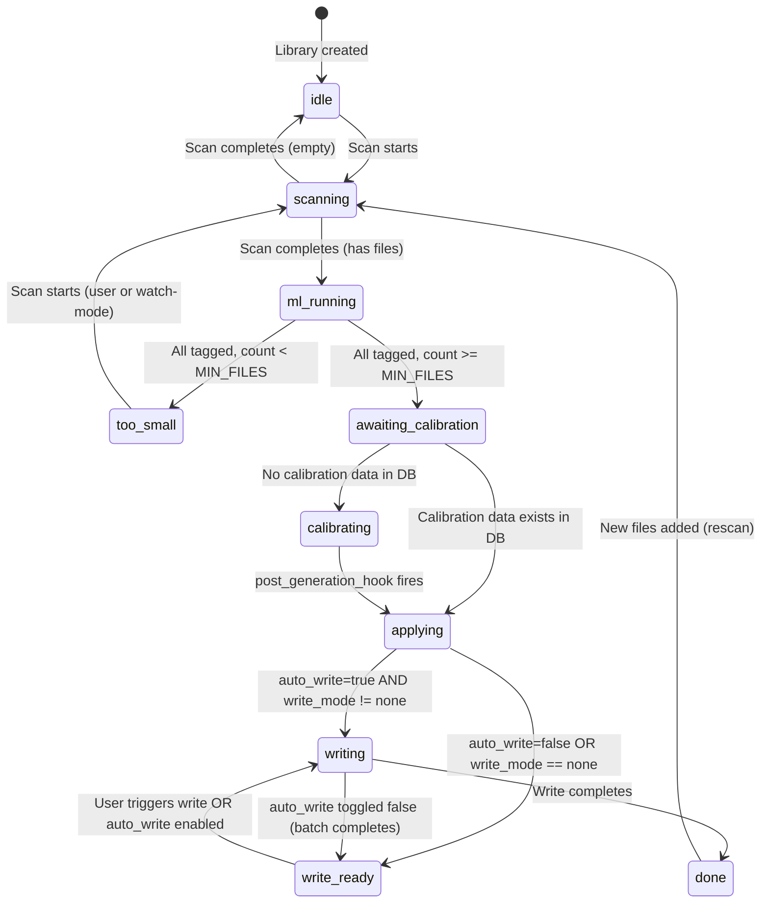

# ML Pipeline End-to-End Automation

**Status:** APPROVED
**Version:** 4.0
**Author:** RnD-DDAuthor
**Created:** 2026-04-04
**Approved:** 2026-04-05
**Slug:** ml-pipeline-automation

**Related Documents:**

- [ADR-003](../../decisions/ADR-003-pure-boolean-state-graph-for-file-processing-pipeline.md) — Pure Boolean State Graph for File Processing Pipeline
- [ADR-004](../../decisions/ADR-004-schema-refactor-v1-graph-normalization.md) — Schema Refactor V1 — Graph Normalization
- [ADR-008](../../decisions/ADR-008-database-only-tag-writes-no-audio-file-writeback.md) — Two-Phase Tag Curation — Deferred File Writeback
- `nomarr/helpers/managed_task.py` — ManagedTask dataclass (merged)
- `nomarr/services/infrastructure/background_tasks_svc.py` — BackgroundTaskService (merged)
- `nomarr/persistence/database/file_states_aql.py` — file_has_state edge pattern (template for library state graph)

---

## Summary

This design automates Nomarr's ML pipeline end-to-end so that adding a library triggers scanning, ML processing, calibration, calibration application, and optionally file writing — with zero manual steps. Each library tracks its pipeline progress via a stored state graph (mirroring the existing `file_has_state` pattern). Calibration auto-runs once on initial system setup; after that it is manual. A per-library `library_auto_write` boolean controls whether tag writing happens automatically or waits for user approval.

---

## Background

After a library scan, Nomarr's ML pipeline requires manual API calls to complete: trigger calibration (`start_histogram_calibration_background`) and write tags to files (`start_write_tags_background`). This forces users to babysit the system, checking progress and clicking through stages.

**Current pipeline (6 stages):**

 | Stage | Name | Automation Status |
 | ------- | ------ | ------------------- |
 | 1 | Library Scan | AUTOMATED — background task via BTS |
 | 2 | ML Processing | AUTOMATED — workers poll for untagged files |
 | 3 | Vector Promotion | AUTOMATED — workers auto-promote on idle |
 | 4 | Histogram Calibration | **MANUAL** — user must call `CalibrationService.start_histogram_calibration_background()` |
 | 5 | Apply Calibration | SEMI-AUTO — fires via `post_generation_hook` after stage 4 |
 | 6 | Write Tags to Files | **MANUAL** — user must call `TaggingService.start_write_tags_background()` |

Stages 4 and 6 are manual. Stage 5 auto-fires after 4 via `post_generation_hook`, but stage 4 must be triggered first. The goal: add a library → everything completes automatically, with an optional gate before file writing.

---

## Goals

1. **Zero manual steps after library creation** — add library → full pipeline completes automatically when `library_auto_write=true`
2. **No surprise automation** — new libraries default `library_auto_write=false`; user opts in explicitly
3. **Fail loudly** — no retry logic, no silent backoff; failures surface immediately in logs
4. **Event-driven** — no polling; state transitions fire immediately when their triggering event occurs
5. **Consistent with existing patterns** — library state graph mirrors `file_has_state` (ADR-003)
6. **Non-invasive** — delegates to existing `CalibrationService` and `TaggingService` for actual work
7. **Observable** — per-library pipeline status via `GET /api/web/library/{id}/pipeline`

## Non-Goals

- **Worker rename** (`DiscoveryWorker` → TBD) — separate DD, fully decoupled from this work
- **Threading pattern changes** — already solved by BackgroundTaskService, not this DD's concern
- **Per-library calibration** — calibration remains global; not addressed here
- **Retry/backoff/ERROR_WAIT** — explicitly rejected; failures error loudly, startup recovery corrects stale states

---

## Architecture

### Per-Library Pipeline with Library State Graph

The pipeline is **per-library**. Each library's pipeline progress is tracked via a **stored state edge** in the graph database, mirroring the `file_has_state` pattern from ADR-003. There is no poll loop. All state transitions are event-driven — triggered by completion callbacks from existing services and workers.

All pipeline stages that need background execution use the merged **ManagedTask + BackgroundTaskService** pattern:

- `ManagedTask` (`nomarr/helpers/managed_task.py`): dataclass wrapping `task_id`, `fn`, `stop_event`, `on_complete`, `daemon`
- `BackgroundTaskService` (`nomarr/services/infrastructure/background_tasks_svc.py`): thread-based task registry with `start_task()`, `cancel_task()`, `get_task_status()`

### Layer Mapping

 | Component | Layer | File Path | Responsibility |
 | ----------- | ------- | ----------- | ---------------- |
 | `LibraryPipelineStatesOps` | persistence | `nomarr/persistence/database/library_pipeline_states_aql.py` | State edge CRUD: transitions, queries, bulk transitions |
 | `LibraryPipelineService` | services/infrastructure | `nomarr/services/infrastructure/pipeline_svc.py` | Startup recovery, calibration trigger, event callback wiring |
 | Post-tagging library check | components/workers | Inline in worker after `set_tagged()` | Query untagged count → transition `ml_running → ml_complete` → fire trigger |
 | `CalibrationService` | services/domain | `nomarr/services/domain/calibration_svc.py` | Existing — add state transitions in `post_generation_hook` |
 | `TaggingService` | services/domain | `nomarr/services/domain/tagging_svc.py` | Existing — rename `reconcile_library` → `write_tags_to_files`; add state transitions on completion |
 | `library_if.py` | interfaces/api/web | `nomarr/interfaces/api/web/library_if.py` | New `GET /{id}/pipeline` endpoint; rename `/reconcile-tags` → `/write-tag`; remove `/reconcile-status` |
 | `LibraryPipelineStatusDTO` | helpers/dto | `nomarr/helpers/dto/library_dto.py` | Pipeline status response DTO |

**`LibraryPipelineService` placement justification:** Infrastructure services coordinate cross-domain orchestration that doesn't belong to any single domain service. `LibraryPipelineService` wires callbacks across `CalibrationService`, `TaggingService`, and `BackgroundTaskService` — the same cross-cutting coordination pattern used by `BackgroundTaskService` itself in `services/infrastructure`. It owns no domain logic; it owns wiring and lifecycle.

### Data Flow

1. **ML completes:** Worker tags last file → queries untagged count via AQL → if 0, transitions library `ml_running → too_small` (if below min) or `ml_running → awaiting_calibration` → calls calibration trigger
2. **Calibration trigger:** `LibraryPipelineService` bulk-transitions all `awaiting_calibration` → `calibrating` → starts `CalibrationService.start_histogram_calibration_background()` via BTS
3. **Calibration completes:** `post_generation_hook` → bulk-transitions all `calibrating` → `applying` → starts `TaggingService.start_apply_calibration_background()` via BTS
4. **Apply completes:** Callback checks `library_auto_write` per library → transitions to `writing` or `write_ready`
5. **Write completes:** Callback transitions `writing → done` → triggers Navidrome rescan
6. File-level state transitions continue on ADR-003 axes independently: `not_tagged → tagged`, `not_calibrated → calibrated`, `tags_not_written → tags_written`

### Hook Wiring

Wire at `app.py` startup:

`python
calibration_svc.set_post_generation_hook(pipeline_svc.on_calibration_complete)
`

Where `on_calibration_complete` bulk-transitions `calibrating → applying` and dispatches the apply task via BTS. This follows the existing pattern where `set_post_generation_hook` accepts a zero-argument callable invoked after successful histogram generation (`heads_failed == 0`).

### Concurrency Safety

- State transitions are atomic (REMOVE + INSERT in single AQL query) — same pattern as `FileStatesOperations._transition_state()` in `nomarr/persistence/database/file_states_aql.py`
- Idempotent transitions: if library is already at target state, transition is a no-op
- `CalibrationService.is_generation_running()` and `BackgroundTaskService.start_task()` have existing guards against concurrent duplicate runs
- Manual user triggers work alongside automation — services reject duplicate runs gracefully

---

## State Machine

### States

 | State | Key | Meaning |
 | ------- | ----- | --------- |
 | Idle | `idle` | Pipeline not started or no files in library |
 | Scanning | `scanning` | Library scan in progress |
 | ML Running | `ml_running` | Workers processing untagged files |
 | Too Small | `too_small` | **Blocking** — file count < `INTERNAL_CALIBRATION_MIN_FILES`. Pipeline halts here until more files are added and scanned. |
 | Awaiting Calibration | `awaiting_calibration` | All files tagged, enough files present, waiting for calibration to start |
 | Calibrating | `calibrating` | Histogram calibration generation in progress |
 | Applying | `applying` | Applying calibration thresholds to tagged files |
 | Write Ready | `write_ready` | Apply complete, `library_auto_write=false`; user must trigger write |
 | Writing | `writing` | Tag write to disk in progress |
 | Done | `done` | All stages complete |

### State Diagram

**Key invariant:** `applying` branches to `write_ready` when `library_auto_write=false` OR `file_write_mode == "none"`, and to `writing` when `library_auto_write=true` AND `file_write_mode != "none"`. Both paths reach `done`. The `writing → write_ready` transition occurs only when `library_auto_write` is toggled false mid-write; the current batch completes gracefully before the transition fires.

### Transition Table

 | From | To | Trigger | Guard |
 | ------ | ---- | --------- | ------- |
 | (none) | `idle` | Library created | — |
 | `idle` | `scanning` | Scan starts | — |
 | `scanning` | `ml_running` | Scan completes | Library has files |
 | `scanning` | `idle` | Scan completes | Library is empty (0 files) |
 | `ml_running` | `too_small` | All files tagged | `tagged_count < INTERNAL_CALIBRATION_MIN_FILES` |
 | `ml_running` | `awaiting_calibration` | All files tagged | `tagged_count >= INTERNAL_CALIBRATION_MIN_FILES` |
 | `too_small` | `scanning` | Scan starts (user-initiated or watch-mode) | — |
 | `awaiting_calibration` | `calibrating` | Calibration trigger fires | `!is_generation_running()` AND `calibration_state` collection is empty |
 | `awaiting_calibration` | `applying` | Calibration data exists in DB | `calibration_state` collection has documents (DB-backed, survives restart) |
 | `calibrating` | `applying` | `post_generation_hook` fires | Generation succeeded |
 | `applying` | `writing` | Apply completes | `library_auto_write=true` AND `file_write_mode != "none"` |
 | `applying` | `write_ready` | Apply completes | `library_auto_write=false` OR `file_write_mode == "none"` |
 | `write_ready` | `writing` | User triggers write OR `library_auto_write` enabled reactively | — |
 | `writing` | `done` | Write completes | — |
 | `writing` | `write_ready` | `library_auto_write` toggled false while writing | Current batch completes gracefully via `ManagedTask.stop_event` |
 | `done` | `scanning` | New files added (rescan via watch-mode or user-initiated scan) | — |

### Startup Recovery

On application startup, `LibraryPipelineService` scans for libraries stuck in states that require an active background task. Since background tasks do not survive restarts, these libraries are recovered to safe states:

 | Stuck State | Recovery Target | Rationale |
 | ------------- | ---------------- | ----------- |
 | `scanning` with no active scan task | `idle` | Scan will restart on next user-initiated or watch-mode trigger |
 | `calibrating` with no BTS task | `awaiting_calibration` | Calibration trigger will re-fire on next idle-path evaluation |
 | `applying` with no BTS task | `awaiting_calibration` | Apply depends on calibration output; re-trigger from calibration check |
 | `writing` with no BTS task | `write_ready` | User can re-trigger write, or auto-write will re-fire if enabled |

Recovery uses `BackgroundTaskService.get_task_status()` to determine whether the expected task is still running. Bulk transitions are used per state (e.g., all `calibrating` libraries with no active calibration task → `awaiting_calibration`).

---

## Library State Graph

### Pattern: Mirrors `file_has_state`

The existing `file_has_state` pattern (ADR-003, implemented in `nomarr/persistence/database/file_states_aql.py`):

- **Vertex collection** `file_states` with 16 singleton vertices (8 axes × 2 poles)
- **Edge collection** `file_has_state` connecting `library_files/{id}` → `file_states/{state}`
- **Atomic transitions** via `_transition_state()`: REMOVE old edge + INSERT new edge in single AQL

The library pipeline state graph follows the same pattern but is simpler (single axis, not 8):

### New Vertex Collection: `library_pipeline_states`

10 singleton vertices, seeded at migration time:

`
library_pipeline_states/idle
library_pipeline_states/scanning
library_pipeline_states/ml_running
library_pipeline_states/too_small
library_pipeline_states/awaiting_calibration
library_pipeline_states/calibrating
library_pipeline_states/applying
library_pipeline_states/write_ready
library_pipeline_states/writing
library_pipeline_states/done
`

### State Vertex Constants

Follow the naming convention from `file_states_aql.py`:

`python
PIPELINE_IDLE = "library_pipeline_states/idle"
PIPELINE_SCANNING = "library_pipeline_states/scanning"
PIPELINE_ML_RUNNING = "library_pipeline_states/ml_running"
PIPELINE_TOO_SMALL = "library_pipeline_states/too_small"
PIPELINE_AWAITING_CALIBRATION = "library_pipeline_states/awaiting_calibration"
PIPELINE_CALIBRATING = "library_pipeline_states/calibrating"
PIPELINE_APPLYING = "library_pipeline_states/applying"
PIPELINE_WRITE_READY = "library_pipeline_states/write_ready"
PIPELINE_WRITING = "library_pipeline_states/writing"
PIPELINE_DONE = "library_pipeline_states/done"
`

### New Edge Collection: `library_has_pipeline_state`

- **From:** `libraries/{id}` → **To:** `library_pipeline_states/{state}`
- Exactly **one** edge per library (single axis)
- No payload on edges — purely structural
- Atomic transition: REMOVE old edge + INSERT new edge (identical pattern to `FileStatesOperations._transition_state()`)

### Persistence Operations: `LibraryPipelineStatesOps`

`python
class LibraryPipelineStatesOps:
    """CRUD for library_has_pipeline_state edges. Mirrors FileStatesOperations."""

    def __init__(self, db: DatabaseLike) -> None: ...

    def transition_state(self, library_id: str, to_state: str) -> None:
        """Atomic REMOVE + INSERT. No-op if already at target state."""

    def get_state(self, library_id: str) -> str:
        """Return current state key (e.g., 'ml_running'). Raises if no edge."""

    def get_libraries_in_state(self, state: str) -> list[str]:
        """INBOUND traversal from state vertex → library IDs."""

    def bulk_transition(self, from_state: str, to_state: str) -> int:
        """Transition ALL libraries from one state to another. Returns count."""
`

---

## Pipeline Trigger Mechanism

### Idle-Path Trigger (ML Completion Detection)

Workers have no existing "library done" signal. The trigger fires in the **idle path** — when a worker's `discover_and_claim_file()` returns `None` (no more work), the worker runs **one count query per library** to check completion:

`ql
FOR lib IN libraries
    FILTER lib.enabled == true
    LET state_edge = FIRST(
        FOR s IN OUTBOUND lib._id library_has_pipeline_state RETURN s._key
    )
    FILTER state_edge == "ml_running"
    LET untagged = LENGTH(
        FOR f IN OUTBOUND lib._id library_contains_file
            FOR e IN file_has_state
                FILTER e._from == f._id AND e._to == "file_states/not_tagged"
                RETURN 1
    )
    FILTER untagged == 0
    LET tagged_count = LENGTH(
        FOR f IN OUTBOUND lib._id library_contains_file
            FOR e IN file_has_state
                FILTER e._from == f._id AND e._to == "file_states/tagged"
                RETURN 1
    )
    RETURN { library_id: lib._id, tagged_count: tagged_count }
`

Python pseudocode for the conditional branch:

`python
for result in completed_libraries:
    lib_id = result["library_id"]
    count = result["tagged_count"]
    if count >= INTERNAL_CALIBRATION_MIN_FILES:
        pipeline_states.transition_state(lib_id, PIPELINE_AWAITING_CALIBRATION)
        # fire calibration trigger
    else:
        pipeline_states.transition_state(lib_id, PIPELINE_TOO_SMALL)
`

**N+1 on libraries is acceptable** — there won't be 1000 libraries. This is NOT per-file; it fires once when the worker goes idle.

### `too_small` Blocking State

When a library has fewer tagged files than `INTERNAL_CALIBRATION_MIN_FILES` (defined in `nomarr/services/infrastructure/config_svc.py`), the pipeline blocks at `too_small`. The library stays in this state until:

- User adds more files and triggers a scan (manually via the UI or automatically via watch-mode) → `too_small → scanning → ml_running → ...`
- After the new files are ML-tagged, the idle-path re-evaluates the count normally. If still below the threshold → back to `too_small`.

The `too_small → scanning` transition fires on scan start — the same mechanism as `done → scanning` (user-initiated scan or watch-mode detecting new files). There is no special trigger; scan start always transitions any library to `scanning` regardless of its current state.

### Idempotency

- If two workers race on idle-path checks, duplicate transitions are no-ops (edge already at target)
- Calibration trigger checks `CalibrationService.is_generation_running()` — existing guard
- `BackgroundTaskService.start_task()` raises `ValueError` if task ID already running

---

## Calibration Flow

### Initial Calibration: Automatic, One-Time

Calibration is **global** — one generation applies to all libraries. The initial calibration auto-runs when the first library accumulates enough tagged files:

1. Worker idle-path detects library in `ml_running` with 0 untagged files and count ≥ `INTERNAL_CALIBRATION_MIN_FILES`
2. Transition: `ml_running → awaiting_calibration`
3. `LibraryPipelineService` bulk-transitions all `awaiting_calibration` → `calibrating`
4. Calls `CalibrationService.start_histogram_calibration_background()` via BTS
5. On success, `post_generation_hook` → bulk-transition `calibrating` → `applying` → trigger `apply_calibration_wf` via BTS
6. On apply completion, per-library branching on `library_auto_write`

**Calibration idempotency:** If calibration is already running when the trigger fires, `start_histogram_calibration_background` returns silently (existing guard: `is_generation_running()` check inside the method). Libraries already in `calibrating` will be transitioned when the in-flight calibration completes via `post_generation_hook`. This is correct and idempotent.

### Post-Initial: Manual Only

After the first calibration completes, subsequent calibrations are **user-triggered only**. New libraries on an established system skip calibration entirely — the `awaiting_calibration → applying` guard queries the `calibration_state` collection in ArangoDB:

`python

# DB-backed check — survives restarts (unlike in-memory get_generation_result())

has_calibration = len(db.calibration_state.get_all_calibration_states()) > 0
if has_calibration:
    pipeline_states.transition_state(lib_id, PIPELINE_APPLYING)
else:
    pipeline_states.bulk_transition(PIPELINE_AWAITING_CALIBRATION, PIPELINE_CALIBRATING)
    calibration_svc.start_histogram_calibration_background()
`

This replaces the previous design that used `CalibrationService.get_generation_result() is not None` — an in-memory field that resets to `None` after restart. The DB-backed check via `CalibrationStateOperations.get_all_calibration_states()` persists across restarts.

### Post-Initial: Manual Calibration Entry Point

After initial calibration, users re-trigger calibration through the existing routes in `nomarr/interfaces/api/web/calibration_if.py`. These routes remain independent of pipeline orchestration — they call `CalibrationService.start_histogram_calibration_background()` directly. The `post_generation_hook` ensures that pipeline state transitions still fire after any calibration completes, whether triggered by the pipeline or by the user manually.

### Elimination of `initial_calibration_done`

No `initial_calibration_done` boolean field is needed. The library's position in the state graph encodes this:

- State is `applying`, `write_ready`, `writing`, or `done` → calibration has occurred
- The state graph captures this structurally

---

## Library Settings

### `library_auto_write` Field

 | Property | Value |
 | ---------- | ------- |
 | Type | `bool` |
 | Default | `false` |
 | Settable at create time | Yes |
 | Changeable after creation | Yes |
 | Storage | Field on library document (NOT in state graph) |

### Reactive Behavior

Changing `library_auto_write` takes effect **immediately**:

**Enabling (`false → true`):**

- If library is in `write_ready` state: immediately transition `write_ready → writing` and start `write_tags_to_files` via BTS
- If library is in any other state: setting is stored, will take effect when `applying` completes

**Disabling (`true → false`):**

- If library is in `writing` state: stops writes at next safe checkpoint via `ManagedTask.stop_event`. No new file writes start. Library transitions `writing → write_ready` when the current batch completes or stops gracefully.
- If library is in any other state: setting is stored, will prevent auto-write when `applying` completes

### `file_write_mode == "none"` Blocking

When `file_write_mode` is set to `"none"`, auto-write is blocked even if `library_auto_write=true`. This is because `file_write_mode="none"` means the user has opted out of file modification entirely at the system level — there is nothing to write. The pipeline branches to `write_ready` so users can see that processing completed, and if they later change `file_write_mode`, they can trigger writes manually.

### Frontend UX

- Library create/edit forms include `library_auto_write` toggle
- **Confirmation dialog** when enabling: "This will write tags to audio files automatically when processing completes. Are you sure?"
- Toggle is always visible regardless of current pipeline state

---

## API Changes

### New Endpoint

**`GET /api/web/library/{library_id}/pipeline`**

Lives on the existing libraries router (`nomarr/interfaces/api/web/library_if.py`, prefix `/library`).

Returns 404 with `{"detail": "Library not found"}` when `library_id` does not match an existing library.

Response body:
`json
{
  "library_id": "libraries/123",
  "state": "applying",
  "untagged_count": null,
  "uncalibrated_count": 42,
  "pending_write_count": null,
  "library_auto_write": false,
  "file_write_mode": "full"
}
`

Counts are selectively populated based on state:

- `untagged_count`: populated when `state == "ml_running"`
- `uncalibrated_count`: populated when `state == "applying"`
- `pending_write_count`: populated when `state in ("write_ready", "writing")`

### Renamed Endpoint

**`POST /api/web/library/{library_id}/write-tag`** (was `POST /{library_id}/reconcile-tags`)

Current implementation already uses `start_write_tags_background()`. Rename the route and endpoint function. Returns `StartTagWriteResponse` with task ID. Navidrome rescan fires via `ManagedTask.on_complete` callback (already wired in current code at `library_if.py` line 640-648).

### Removed Endpoint

**`GET /api/web/library/{library_id}/reconcile-status`** — **removed entirely** (not deprecated). Superseded by `GET /{library_id}/pipeline`. The current implementation uses `ReconcileStatusResponse` (a Pydantic model in `nomarr/interfaces/api/types/library_types.py`) — this class is deleted (not renamed), and the new `PipelineStatusResponse` replaces it with a superset of fields.

### Modified Endpoints

**`POST /api/web/library`** (create) and **`PATCH /api/web/library/{id}`** (update):

- Accept `library_auto_write: bool` field

---

## Frontend Changes

### Library Card: Pipeline State Badge

Each library card displays its current pipeline state as a chip/badge:

- `idle` → gray
- `scanning`, `ml_running` → blue (processing)
- `too_small` → orange (attention needed)
- `awaiting_calibration`, `calibrating`, `applying` → blue (processing)
- `write_ready` → yellow (action available)
- `writing` → blue (processing)
- `done` → green (complete)

### Dashboard: Per-Library Progress Indicators

Dashboard shows all libraries with their pipeline states. Libraries needing attention (`too_small`, `write_ready`) are visually highlighted.

Files touched for dashboard integration:

- `nomarr/interfaces/api/web/info_if.py` — `GET /api/web/work-status` needs per-library pipeline state data
- `nomarr/interfaces/api/types/info_types.py` — `WorkStatusResponse` needs per-library pipeline fields
- `nomarr/helpers/dto/info_dto.py` — `WorkStatusResult` needs pipeline payload
- `nomarr/services/domain/library_svc/query.py` — `get_work_status()` needs pipeline state data
- `nomarr/components/library/work_status_comp.py` — add pipeline state awareness
- `frontend/src/shared/api/processing.ts` — frontend dashboard contract

### Auto-Write Toggle

- Present in library create form and library edit/settings form
- Toggle with confirmation dialog: "This will write tags to audio files automatically when processing completes. Are you sure?"
- Shows current state of `library_auto_write`

### API Renames

 | Old | New |
 | ----- | ----- |
 | `reconcileTags()` | `writeTags()` |
 | `getReconcileStatus()` | `getPipelineStatus()` |
 | Route `/{id}/reconcile-tags` | Route `/{id}/write-tag` |
 | Route `/{id}/reconcile-status` | Route `/{id}/pipeline` |
 | `ReconcileStatusResponse` | Deleted (replaced by `PipelineStatusResponse`) |
 | UI copy "Reconcile Tags" | "Write Tags" |

---

## Data Model

### New Collections

**`library_pipeline_states`** (vertex collection — singleton, seeded by migration):

10 vertices with keys: `idle`, `scanning`, `ml_running`, `too_small`, `awaiting_calibration`, `calibrating`, `applying`, `write_ready`, `writing`, `done`.

**`library_has_pipeline_state`** (edge collection):

`_from: libraries/{id}` → `_to: library_pipeline_states/{state}`

One edge per library. No payload.

### Library Document Addition

`python
library_auto_write: bool  # default: False
`

No `initial_calibration_done` field — absorbed into the state graph.

### DTOs

**`LibraryPipelineStatusDTO`** (new):
`python
from typing import Literal

PipelineState = Literal[
    "idle", "scanning", "ml_running", "too_small",
    "awaiting_calibration", "calibrating", "applying",
    "write_ready", "writing", "done",
]

@dataclass
class LibraryPipelineStatusDTO:
    library_id: str
    state: PipelineState               # state vertex key, e.g. "ml_running"
    untagged_count: int | None         # populated when state == "ml_running"
    uncalibrated_count: int | None     # populated when state == "applying"
    pending_write_count: int | None    # populated when state in ("write_ready", "writing")
    library_auto_write: bool
    file_write_mode: str               # "none", "minimal", "full"
`

**`WriteTagsResult`** (renamed from `ReconcileTagsResult`):
Same fields, new name. Currently defined in `nomarr/helpers/dto/library_dto.py`.

### Renames

 | Layer | Old | New |
 | ------- | ----- | ----- |
 | Service method | `TaggingService.reconcile_library()` | `TaggingService.write_tags_to_files()` |
 | DTO | `ReconcileTagsResult` | `WriteTagsResult` |
 | Response type | `ReconcileTagsResponse` / `ReconcileStatusResponse` | `WriteTagsResponse` / deleted (`PipelineStatusResponse` replaces) |

The underlying workflow `write_file_tags_workflow` already has the correct name. The `start_write_tags_background()` method name is already correct (BTS work renamed it).

---

## Migration

Forward-only migration. Latest existing migration is V022 (version 0.2.2). This will be V023+.

### Steps

1. **Create `library_pipeline_states` vertex collection** — seed 10 singleton state vertices (`idle`, `scanning`, `ml_running`, `too_small`, `awaiting_calibration`, `calibrating`, `applying`, `write_ready`, `writing`, `done`)
2. **Create `library_has_pipeline_state` edge collection** — with graph edge definition linking `libraries` → `library_pipeline_states`
3. **Add `library_auto_write: false`** to all existing library documents
4. **Derive initial state for each existing library** using file state counts:
   - No files or no tagged files → `idle`
   - Has untagged files → `ml_running`
   - All tagged, count < `INTERNAL_CALIBRATION_MIN_FILES` → `too_small`
   - All tagged, count >= min, has uncalibrated files → `awaiting_calibration`
   - All calibrated, has unwritten files → `write_ready`
   - All written → `done`
5. **Create one `library_has_pipeline_state` edge per library** pointing to derived state

### Constants Cleanup

 | Constant | Action | Notes |
 | ---------- | -------- | ------- |
 | `INTERNAL_CALIBRATION_AUTO_RUN` | DELETE from `nomarr/services/infrastructure/config_svc.py` | Replaced by event-driven pipeline |
 | `INTERNAL_CALIBRATION_CHECK_INTERVAL` | DELETE from `nomarr/services/infrastructure/config_svc.py` | Replaced by event-driven pipeline |
 | `INTERNAL_CALIBRATION_MIN_FILES` | KEEP in `nomarr/services/infrastructure/config_svc.py` | Threshold for `too_small` → `awaiting_calibration` gate |

Re-exports of `INTERNAL_CALIBRATION_AUTO_RUN` and `INTERNAL_CALIBRATION_CHECK_INTERVAL` must also be removed from:

- `nomarr/services/__init__.py`
- `nomarr/services/infrastructure/__init__.py`

---

## Testing Strategy

### Unit Tests

 | Area | Tests |
 | ------ | ------- |
 | `LibraryPipelineStatesOps` | `transition_state` atomic behavior, idempotent no-op on same state, `get_state`, `get_libraries_in_state`, `bulk_transition` |
 | `LibraryPipelineService` | Startup recovery scan corrects stale states, calibration trigger logic (fires/skips), callback wiring |
 | Worker idle-path check | Returns correct libraries needing transition, handles empty result, idempotent |
 | `library_auto_write` reactive behavior | Enable triggers write from `write_ready`, disable signals stop, no-op from other states |
 | State transition guards | `too_small` blocks pipeline, `awaiting_calibration` skips if calibration exists (DB check), `applying` branches on auto_write + write_mode |

### Integration Tests

 | Area | Tests |
 | ------ | ------- |
 | Full pipeline flow | `idle → scanning → ml_running → awaiting_calibration → calibrating → applying → write_ready → done` with mocked ML |
 | `too_small` blocking | Library with < `INTERNAL_CALIBRATION_MIN_FILES` files blocks at `too_small`, adding files + rescan resumes |
 | Concurrent workers | Two workers finishing last files simultaneously — one transition succeeds, other is no-op |
 | New library on established system | Skips calibration (DB check), goes `awaiting_calibration → applying` directly |
 | Reactive auto_write | Toggle on during `write_ready` → immediately starts writing |
 | Startup recovery | Libraries stuck in `calibrating` after restart → recovered to `awaiting_calibration` |

### Frontend Tests

 | Area | Tests |
 | ------ | ------- |
 | Pipeline status badge | Renders correct color/label for each state |
 | Auto-write toggle | Confirmation dialog appears, setting persists |
 | API client renames | `writeTags()` and `getPipelineStatus()` call correct endpoints |

---

## Affected Files: Scan Lifecycle

Scan → pipeline state transitions touch these existing files:

- `nomarr/workflows/library/scan_setup_wf.py` — scan start marks; add pipeline state transition `* → scanning` on scan initiation
- `nomarr/components/library/scan_lifecycle_comp.py` — scan lifecycle hooks; scan completion triggers `scanning → ml_running` or `scanning → idle` pipeline transition

---

## Documentation

### Docs to Update

 | Document | Change |
 | ---------- | -------- |
 | `docs/user/` | New section on pipeline automation, auto-write setting explanation |
 | `docs/dev/migrations.md` | Reference new V023 migration |
 | `docs/dev/architecture.md` | Update: references to `/reconcile-tags` and `/reconcile-status` must be replaced with `/write-tag` and `/pipeline` |
 | `docs/dev/workers.md` | Update: describes worker behavior around old write-tag path — add idle-path pipeline trigger documentation |
 | `docs/dev/domains.md` | Update: domain mapping will be stale with new `LibraryPipelineService` in infrastructure — add pipeline service entry |
 | `nomarr/persistence/PERSISTENCE.md` | Add `library_pipeline_states_aql.py` to persistence map |
 | API docs (if generated) | New endpoint, removed endpoint, renamed endpoint |
 | `frontend/README.md` | Updated library management features |

### Inline Documentation

- `LibraryPipelineStatesOps` class docstring explaining the pattern and its relationship to `FileStatesOperations`
- `LibraryPipelineService` docstring explaining startup recovery and event-driven transitions
- State constants with docstrings explaining each state's meaning and valid transitions

---

## Implementation Phases

Ordered for the Exec-Planner. Each phase is independently testable.

### Phase A: Persistence Layer

1. Create `library_pipeline_states_aql.py` with `LibraryPipelineStatesOps`
2. Add state vertex constants (10 states) following `PIPELINE_*` naming convention
3. Implement `transition_state`, `get_state`, `get_libraries_in_state`, `bulk_transition`
4. Wire into `Database` class in `nomarr/persistence/db.py`
5. Unit tests for all operations

### Phase B: Migration

1. Write V023 migration: create collections, seed vertices, derive initial states, add `library_auto_write`
2. Test migration against empty DB and DB with existing libraries in various stages

### Phase C: Library Settings

1. Add `library_auto_write: bool` to `LibraryDict` in `nomarr/helpers/dto/library_dto.py`
2. Propagate through library create/update: `libraries_aql.py` → `library_admin_comp.py` / `update_library_metadata_comp.py` → `library_svc` → `library_if.py`
3. Add to API request/response types in `nomarr/interfaces/api/types/library_types.py`
4. Insert initial `idle` state edge on library creation

### Phase D: Pipeline Service + Calibration Trigger

1. Create `LibraryPipelineService` in `nomarr/services/infrastructure/pipeline_svc.py`
2. Implement startup recovery scan (see Startup Recovery table above)
3. Implement calibration trigger logic (idle-path detection, bulk transitions, BTS dispatch)
4. Wire `post_generation_hook` in `CalibrationService` to transition `calibrating → applying`: `calibration_svc.set_post_generation_hook(pipeline_svc.on_calibration_complete)` at `app.py` startup
5. Wire apply completion callback to branch on `library_auto_write`
6. Wire into `app.py` startup lifecycle

### Phase E: Worker Integration

1. Add idle-path library completion check in worker code
2. Implement per-library count query (AQL returns `tagged_count`) and state transition
3. Wire calibration trigger from worker idle path

### Phase F: Endpoint Changes + Renames

1. Rename `reconcile_library` → `write_tags_to_files` in `TaggingService`
2. Rename `ReconcileTagsResult` → `WriteTagsResult`, `ReconcileTagsResponse` → `WriteTagsResponse`
3. Rename route `/reconcile-tags` → `/write-tag`
4. Delete `GET /{id}/reconcile-status` endpoint and `ReconcileStatusResponse` class entirely
5. Add `GET /{id}/pipeline` endpoint returning `PipelineStatusResponse` (404 when library not found)
6. Wire write completion callback to transition `writing → done` + Navidrome rescan
7. Implement reactive `library_auto_write` toggle (immediate effect on `write_ready` libraries; `writing → write_ready` on disable)

### Phase G: Frontend + Dashboard

1. Update API client: rename functions, update routes
2. Add pipeline state badge to library cards
3. Add per-library progress indicators to dashboard (touch work-status backend path: `info_if.py`, `info_types.py`, `info_dto.py`, `library_svc/query.py`, `work_status_comp.py`, `frontend/src/shared/api/processing.ts`)
4. Add `library_auto_write` toggle to library create/edit forms with confirmation dialog
5. Frontend tests

### Phase H: Documentation + Cleanup

1. Delete `INTERNAL_CALIBRATION_AUTO_RUN` and `INTERNAL_CALIBRATION_CHECK_INTERVAL` from `nomarr/services/infrastructure/config_svc.py`
2. Remove re-exports of deleted constants from `nomarr/services/__init__.py` and `nomarr/services/infrastructure/__init__.py`
3. Update `PERSISTENCE.md`, user docs, dev docs (`docs/dev/architecture.md`, `docs/dev/workers.md`, `docs/dev/domains.md`)
4. Final integration test pass

---

## References

 | Reference | Location |
 | ----------- | ---------- |
 | ManagedTask dataclass | `nomarr/helpers/managed_task.py` |
 | BackgroundTaskService | `nomarr/services/infrastructure/background_tasks_svc.py` |
 | file_has_state pattern | `nomarr/persistence/database/file_states_aql.py` — `FileStatesOperations`, `_transition_state()`, state vertex constants |
 | CalibrationService | `nomarr/services/domain/calibration_svc.py` — `start_histogram_calibration_background()`, `is_generation_running()`, `set_post_generation_hook()` |
 | CalibrationStateOperations | `nomarr/persistence/database/calibration_state_aql.py` — `get_all_calibration_states()` (DB-backed calibration existence check) |
 | TaggingService | `nomarr/services/domain/tagging_svc.py` — `reconcile_library()` (to be renamed), `start_write_tags_background()` |
 | Current reconcile-status endpoint | `nomarr/interfaces/api/web/library_if.py` — `get_reconcile_status()` (to be removed) |
 | Calibration min files | `nomarr/services/infrastructure/config_svc.py` — `INTERNAL_CALIBRATION_MIN_FILES` |
 | Scan lifecycle | `nomarr/workflows/library/scan_setup_wf.py`, `nomarr/components/library/scan_lifecycle_comp.py` |
 | Work-status backend | `nomarr/interfaces/api/web/info_if.py`, `nomarr/components/library/work_status_comp.py` |
 | Manual calibration routes | `nomarr/interfaces/api/web/calibration_if.py` — independent of pipeline, `post_generation_hook` fires regardless |
 | ADR-003 | `artifacts/decisions/ADR-003-pure-boolean-state-graph-for-file-processing-pipeline.md` |
 | ADR-004 | `artifacts/decisions/ADR-004-schema-refactor-v1-graph-normalization.md` |
 | Latest migration | `nomarr/migrations/V022_seed_pp_max_genre_playlists.py` (V022 / version 0.2.2) |
