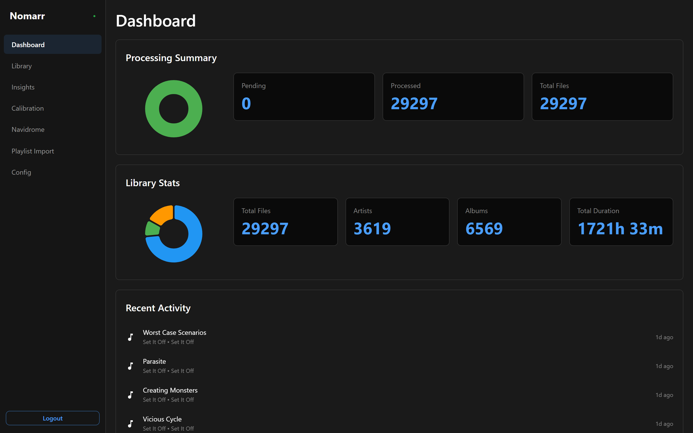
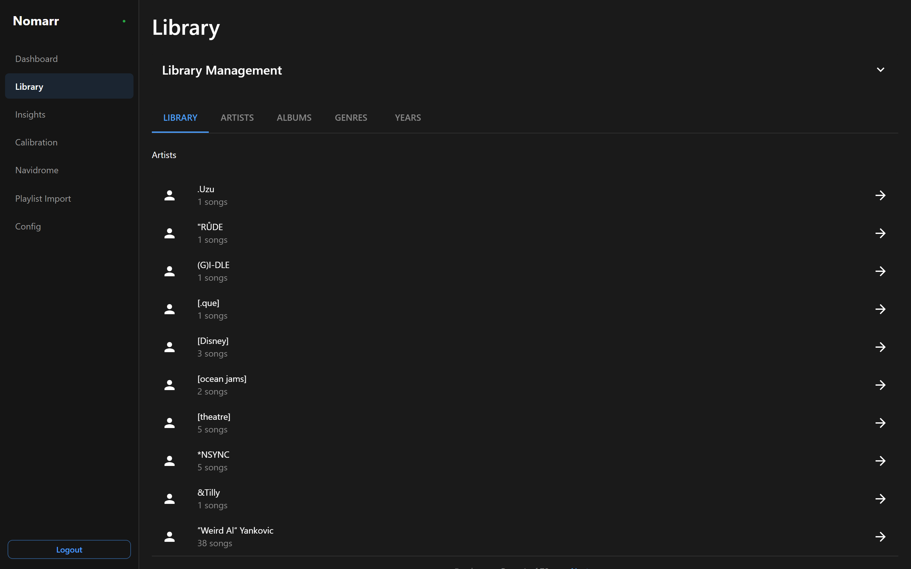
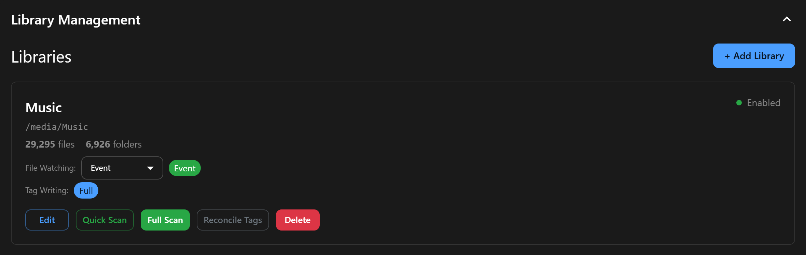
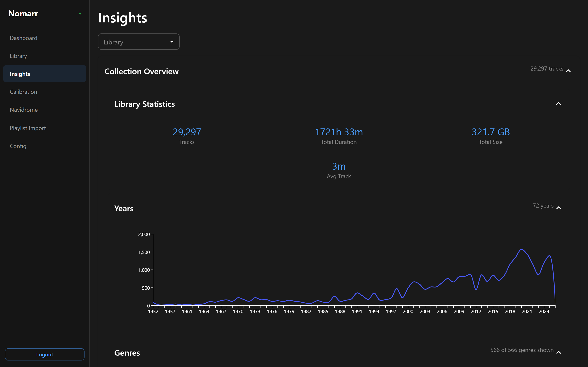
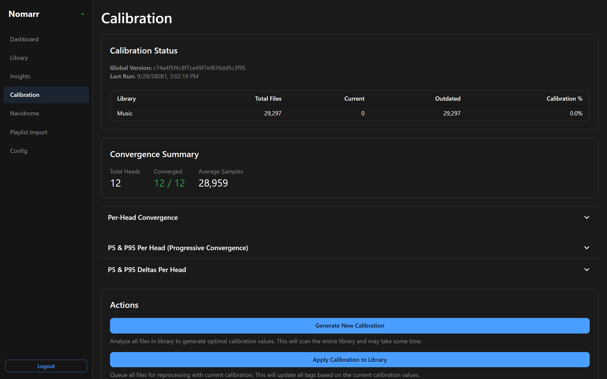
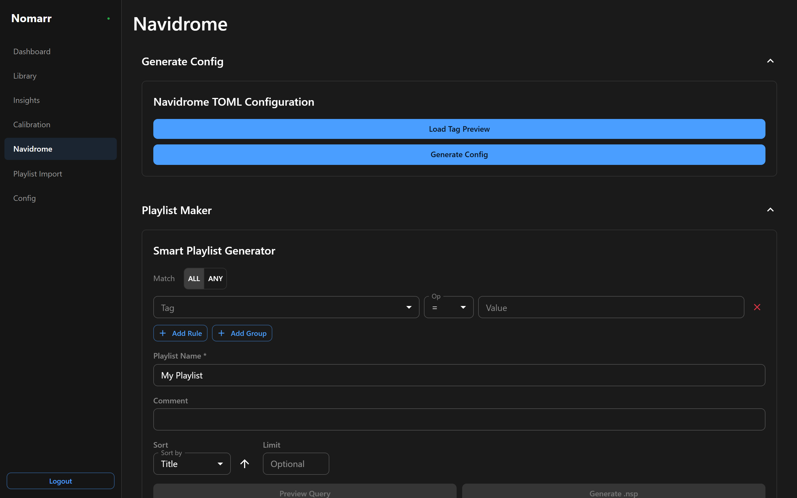
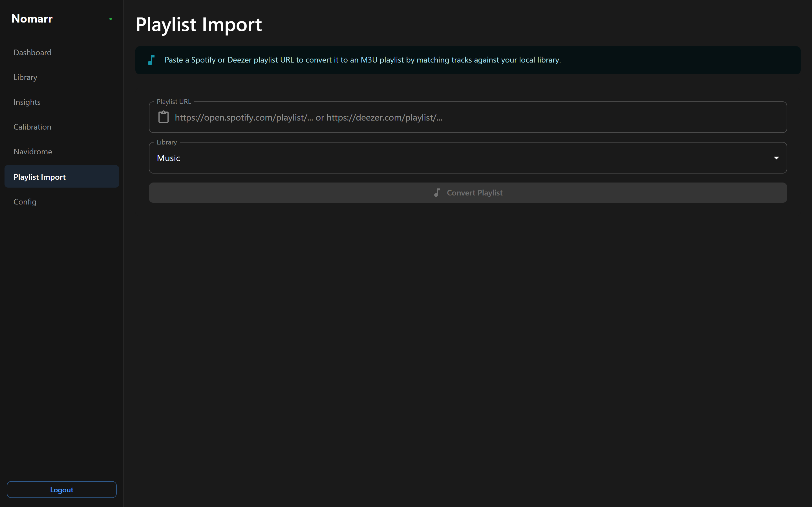

# Nomarr

**Intelligent audio auto-tagging for your music library using state-of-the-art machine learning.**

Nomarr is an alpha audio tagging system that analyzes your music files with Essentia's pre-trained ML models and writes rich metadata tags directly into your audio files (MP3, M4A, FLAC, OGG, Opus, WAV, AAC, AIFF, and more). Perfect for organizing large libraries, discovering moods, and enriching metadata for music servers like Navidrome and Plex.

Nomarr tags your audio files with:

- **Mood & Emotion** — Happy, sad, aggressive, relaxed, party, etc.
- **Acoustic Properties** — Danceability, energy, timbre, brightness
- **Audio Characteristics** — Vocal presence, tonal/atonal classification

All tags are written as native metadata (ID3v2 for MP3, iTunes atoms for M4A, Vorbis comments for OGG/FLAC/Opus) with the `nom:` namespace prefix — no external database required.

You set a library path, scan, and get high quality ML tags in roughly a day (based on an 18k song library over a NAS share — your time may be lower or higher).

**Note:** Nomarr comes with mood and acoustic property models. Additional models (genre, instruments, etc.) can be added by users but are not included by default.

## WARNING

A BIG CAPITAL WARNING that the EFFNET embedder (so any EFFNET HEADS used) REQUIRES 9 GB of VRAM to run. It's the difference between a 40s per song and a 2 second per song during ML analysis. The embedder is cached in VRAM to prevent spin-up time each song, and will remain resident on VRAM for about 30 seconds after the last song is tagged.

---


## ✨ Key Features

- **🌐 Modern Web UI** — Full browser interface for library management, analytics, calibration, and integrations
- **📚 Library Scanner** — Background scanning with tag extraction and real-time progress tracking
- **👁️ File Watching** — Monitors filesystem for changes and triggers incremental scans (2–5 second response)
- **📊 Calibration System** — Normalize model outputs across heads with convergence tracking and drift detection
- **🔍 Library Insights** — Collection overview, mood analysis, tag co-occurrence matrix, and genre/year distributions
- **🎵 Navidrome Integration** — Smart playlist (.nsp) generation and TOML config export
- **📥 Playlist Import** — Convert Spotify and Deezer playlists to local M3U with fuzzy matching, metadata display, and manual search
- **⚡ GPU Accelerated** — NVIDIA CUDA support for fast ML inference
- **🎨 Rich Metadata** — Writes probabilities, tiers, and aggregated mood tags in native format
- **🔐 Secure** — API key authentication for automation, session-based auth for web UI
- **🐳 Docker Native** — Compose-based deployment with NVIDIA GPU passthrough and ArangoDB backend

---

## Quick Start

### Prerequisites

- Docker with NVIDIA GPU support (for GPU acceleration)
- Music library mounted at consistent path

### Installation

1. **Clone and configure:**

   ```bash
   git clone https://github.com/xiaden/nomarr.git
   cd nomarr/docker
   ```

2. **Configure environment files:**

   ```bash
   # Copy example env files
   cp nomarr-arangodb.env.example nomarr-arangodb.env
   cp nomarr.env.example nomarr.env

   # Edit nomarr-arangodb.env and set a strong root password
   # Edit nomarr.env and set the same root password
   ```

3. **Create config directories and start:**

   ```bash
   mkdir -p config/arangodb
   docker compose up -d
   ```

   On first run, Nomarr will:
   - Provision the ArangoDB database
   - Generate an app password (stored in `config/nomarr.yaml`)
   - Create an admin password for the web UI

4. **Get your admin password:**

   Check container logs for the auto-generated password:

   ```bash
   docker compose logs nomarr | grep "Admin password"
   ```

5. **Access the Web UI:**

   - Navigate to `http://localhost:8356/` (if port is exposed in compose) or via your reverse proxy
   - Login with the admin password from step 4
   - Add a library and start scanning!

---

## Web UI

### Dashboard

Real-time system overview with processing progress (including velocity tracking and ETA), library statistics with genre/year charts, and recent scan activity.



### Browse

Hierarchical library browser with Artist → Album → Track drill-down, plus flat entity tabs for Artists, Albums, Genres, and Years. Tag-based exploration lets you find songs by exact string match or nearest numeric value.



Library management is built in — add libraries, trigger scans, and monitor scan status from a collapsible panel:



### Insights

Library analytics organized into three sections: **Collection Overview** (stats, top genres, years, artists), **Mood Analysis** (coverage, balance, vibes, mood combos), and **Advanced** (tag frequency distributions and a full co-occurrence matrix). All filterable by library.



### Calibration

Generate calibration profiles from your library data, apply them to normalize model outputs, and update new files. Convergence tracking shows per-head stability across calibration rounds with summary stats and P5/P95 charts.



### Navidrome

Two tools for Navidrome users: **Generate Config** creates a TOML configuration file mapping Nomarr tags to Navidrome's smart playlist fields. **Playlist Maker** builds `.nsp` smart playlist files using tag-based filter groups with preview and sort options.



### Playlist Import

Paste a Spotify or Deezer playlist URL and Nomarr converts it to a local M3U file by fuzzy-matching tracks against your library. Results show match confidence, matched file metadata (artist, album, duration, bitrate), and let you search for alternatives or manually add tracks.



---

## Example Output

Nomarr writes tags using the `nom:` namespace prefix:

```
nom:happy_essentia21b6dev1389_effnet20220825_happy20220825 = 0.7234
nom:aggressive_essentia21b6dev1389_effnet20220825_aggressive20220825 = 0.1203
nom:danceability_essentia21b6dev1389_effnet20220825_danceability20220825 = 0.8941
nom:voice_instrumental_essentia21b6dev1389_effnet20220825_voice_instrumental20220825 = 0.2341
nom:mood-strict = ["peppy", "party-like", "synth-like", "bright timbre"]
nom:mood-regular = ["peppy", "party-like", "synth-like", "bright timbre", "easy to dance to"]
nom:mood-loose = ["peppy", "party-like", "synth-like", "bright timbre", "easy to dance to", "has vocals"]
nom_version = 1.0.0
```

Each numeric tag includes the full model head identifier: `{label}_{framework}_{embedder}_{head}`. Aggregated mood tags combine predictions across multiple heads into three confidence tiers (strict ⊂ regular ⊂ loose) using human-readable labels. The `nom_version` tag tracks which tagger version processed each file.

---

## Documentation

- **[Getting Started](docs/user/getting_started.md)** — Installation, setup, and first steps
- **[API Reference](docs/user/api_reference.md)** — Complete endpoint documentation and examples
- **[Deployment Guide](docs/user/deployment.md)** — Docker setup, configuration, and production best practices
- **[Navidrome Integration](docs/user/navidrome.md)** — Smart playlist generation guide
- **[Architecture](docs/dev/architecture.md)** — System design and component overview
- **[Developer Documentation](docs/index.md)** — Complete documentation index

---

## Repository Structure

| Directory | Purpose |
|-----------|--------|
| `nomarr/` | Python backend (FastAPI, clean architecture) |
| `frontend/` | React/TypeScript SPA |
| `code-intel/` | MCP server for Python code navigation |
| `scripts/` | Build tools, viewers, analysis scripts |
| `e2e/`, `tests/` | Integration and unit tests |

---

## License & Usage

**Nomarr is licensed under [CC BY-NC-SA 4.0](https://creativecommons.org/licenses/by-nc-sa/4.0/) — Non-Commercial use only**

This project is designed for the self-hosted music community and personal use. Commercial use is not permitted.

- **Attribution Required:** Credit Nomarr and the Music Technology Group, Universitat Pompeu Fabra (for Essentia models)
- **ShareAlike:** Derivative works must use the same license
- **Non-Commercial:** No commercial use without explicit permission

See [LICENSE](LICENSE) and [NOTICE](NOTICE) for complete attribution and third-party license information.

---

## Credits

Built with:

- **[Essentia](https://essentia.upf.edu/)** — Audio analysis and ML models by Music Technology Group, UPF
- **[TensorFlow](https://www.tensorflow.org/)** — Machine learning inference
- **[FastAPI](https://fastapi.tiangolo.com/)** — Modern Python web framework
- **[Rich](https://github.com/Textualize/rich)** — Beautiful terminal UI

See [Developer Documentation](docs/index.md) for complete technical details.

---

## Contributing

Contributions are welcome! This project is in active development.

**Note:** Please consult with MTG, UPF regarding any contributions that modify model processing or create derivative works of the ML models, as they are subject to CC BY-NC-SA 4.0 ShareAlike terms.

---

## Support

- **Issues:** [GitHub Issues](https://github.com/xiaden/nomarr/issues)
- **Discussions:** [GitHub Discussions](https://github.com/xiaden/nomarr/discussions)

---

**Made with ❤️ for the self-hosted music community**
