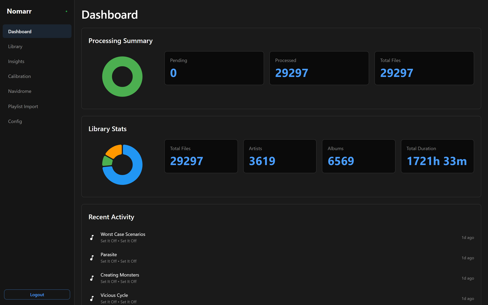
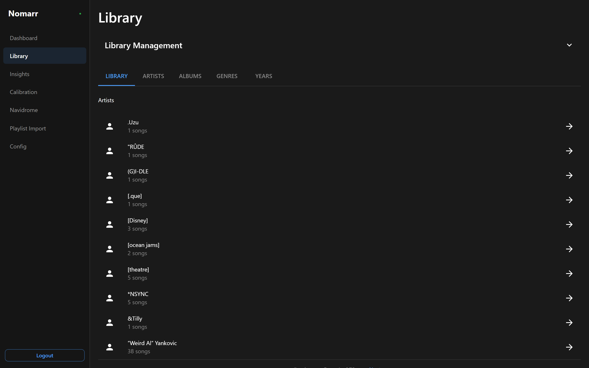
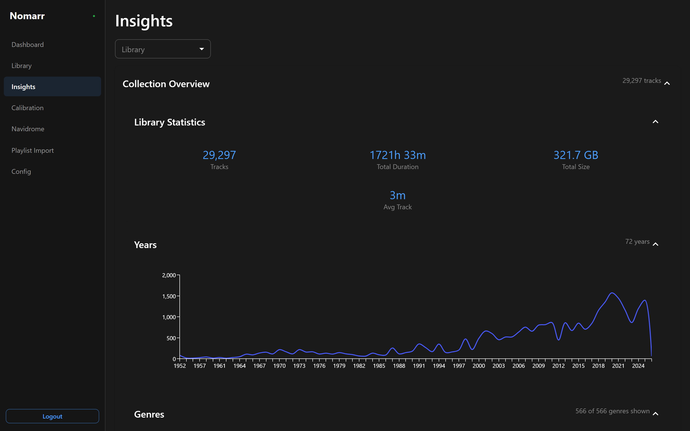

# Nomarr

**The interesting part between raw audio files and actually usable discovery data.**

Nomarr analyzes your music library with ML models and writes the results back into your files as tags. Not into some proprietary database that disappears when you switch tools. Your files. Your metadata. Portable forever.

> **Alpha software** — breaking changes happen, forward-only migrations, back up before upgrading.

---

## Why Nomarr?

Most music analysis tools do one of two things: index your library into a database you can't take anywhere, or dump CSVs that require a data science degree to actually use.

Nomarr writes directly into your audio files. Genre predictions, mood tags, BPM, key — it all lives in standard metadata fields your music player already knows how to read. Scan once, use everywhere. Rescan when you want. The tags stay with your library.

Supports all common audio formats except WMA.

---

## Tags that actually mean something

Most ML taggers spray predictions at your files — 47 genres, 23 moods, whatever the model spits out. You end up with every song tagged "electronic" and "chill" because technically the model was 51% confident.

Nomarr takes a different approach: comparative analysis between model outputs. We run multiple embedding models on every track and only surface tags where there's meaningful agreement. Fewer tags, but tags you can actually trust.

Quality over quantity. Your playlists will thank you.

---

## How fast?

Real numbers, real hardware:

 | Library size | Setup | Time |
 | -------------- | ------- | ------ |
 | 30k songs | Nomarr, 2 workers, 2080 Ti | ~8 hours |
 | 30k songs | Audiomuse, CPU only (default) | 56+ hours |

GPU inference isn't optional if you value your time.

---

## What it looks like

### Dashboard

Monitor scans, track velocity, watch your library grow.



### Browse & Manage

Explore your library, check tag coverage, manage library settings.



### Insights

Collection-level analytics and tag distribution across your music.



---

## Features

- **Scan & tag** — analyze audio with ONNX-accelerated ML, write results to file metadata
- **File watching** — optional per-library modes (`off` / `event` / `poll`), not always-on by default
- **Calibration** — tune model output before applying it across your collection
- **Vector search** — find similar tracks, explore your library by audio similarity
- **Navidrome integration** — not just playlist export, but real integration:
  - **Instant mix** — "find me 20 songs like this one" on the fly
  - **Smart playlist builder** — tag-based rules that auto-update
  - **Daily mixes** — scheduled playlist generation based on your library's characteristics
- **Playlist import** — pull Spotify or Deezer playlists into local M3U files with fuzzy matching
- **Full web UI** — Dashboard, Library, Insights, Calibration, Vector Search, Navidrome, Playlist Import, Config, Admin
- **API access** — session auth for the UI, API keys for automation

---

## Under the hood

For the technically curious:

- **Dual embedding models** — out of the box, every song gets processed by TWO different embedding models. BYO models supported with proper folder structure.
- **Custom Essentia build** — audio loading and preprocessing via a hardened Essentia fork. Corrupt files won't crash the application. This is why Docker-only is the supported path.
- **ArangoDB** — graph database dynamics for relationship queries ("songs similar to X that share tags with Y"), relational speed for standard operations. Best of both worlds.

---

## Before you deploy

Let's be honest about what you're getting into:

- **Docker only.** That's the supported path. If you want to run it bare-metal, you're on your own (we use a custom Essentia build for audio loading, and there's a LOT of pinned dependencies).
- **GPU strongly recommended.** CPU inference works, but you'll be waiting a while. CUDA (NVIDIA GPUs) makes this practical for large libraries.
- **Alpha means alpha.** It works. It's useful. It will also change.

---

## Getting started

```bash
git clone https://github.com/xiaden/nomarr.git
cd nomarr/docker
cp nomarr.env.example nomarr.env
cp nomarr-arangodb.env.example nomarr-arangodb.env
# Edit both .env files — set a strong root password, map your music library volume
docker compose up -d
docker compose logs nomarr | grep "Admin password"
```

That gets you running. The **[Getting Started guide](docs/user/getting_started.md)** has the full walkthrough — GPU setup, reverse proxy, first scan.

### Docker image tags

If you pull published images from GHCR instead of building locally, use these tags:

- `ghcr.io/xiaden/nomarr:latest` — current stable release from `main`
- `ghcr.io/xiaden/nomarr:v0.2.3` — pinned stable release from `main`
- `ghcr.io/xiaden/nomarr:0.2.3.dev42` — pre-release development build from `develop`
- `ghcr.io/xiaden/nomarr:<sha>` — commit-specific image for an exact build

Once running, the API docs live at **`/docs`** (FastAPI's built-in OpenAPI UI).

---

## Documentation

### For users

- [Getting Started](docs/user/getting_started.md)
- [Deployment Guide](docs/user/deployment.md)
- [Navidrome Integration](docs/user/navidrome.md)
- [Playlist Import](docs/user/playlist_import.md)
- [Troubleshooting](docs/user/troubleshooting.md)

### For developers

- [Documentation Index](docs/index.md)
- [Architecture](docs/dev/architecture.md)
- [Domains](docs/dev/domains.md)
- [Workers](docs/dev/workers.md)
- [Migrations](docs/dev/migrations.md)
- [Vector Stores](docs/dev/vector-stores.md)

---

## Repository structure

 | Path | What's there |
 | ------ | ------ |
 | `nomarr/` | Python backend — interfaces, services, workflows, components, persistence |
 | `frontend/` | React + TypeScript web UI |
 | `docker/` | Compose files, environment examples, deployment assets |
 | `docs/` | User and developer docs |
 | `tests/` | Backend tests |
 | `e2e/` | End-to-end tests |
 | `scripts/` | Build and dev tooling |

---

## What ends up in your files

Nomarr writes tags using the `nom:` namespace prefix:

```
nom:happy_essentia21b6dev1389_effnet20220825_happy20220825 = 0.7234
nom:aggressive_essentia21b6dev1389_effnet20220825_aggressive20220825 = 0.1203
nom:danceability_essentia21b6dev1389_effnet20220825_danceability20220825 = 0.8941
nom:mood-strict = ["peppy", "party-like", "synth-like", "bright timbre"]
nom:mood-regular = ["peppy", "party-like", "synth-like", "bright timbre", "easy to dance to"]
nom:mood-loose = ["peppy", "party-like", "synth-like", "bright timbre", "easy to dance to", "has vocals"]
nom_version = 1.0.0
```

Each numeric tag includes the full model head identifier: `{label}_{framework}_{embedder}_{head}`. Aggregated mood tags combine predictions across multiple heads into three confidence tiers (strict ⊂ regular ⊂ loose) using human-readable labels.

---

## Contributing

Contributions welcome. Read **[CONTRIBUTING.md](CONTRIBUTING.md)** first.

- [Issues](https://github.com/xiaden/nomarr/issues)
- [Discussions](https://github.com/xiaden/nomarr/discussions)

---

## Credits

Built with:

- **[Essentia](https://essentia.upf.edu/)** — Audio loading and preprocessing, by the Music Technology Group, Universitat Pompeu Fabra
- **[ONNX Runtime](https://onnxruntime.ai/)** — ML inference engine
- **[FastAPI](https://fastapi.tiangolo.com/)** — Python web framework
- **[ArangoDB](https://www.arangodb.com/)** — Multi-model database

---

## License

**[CC BY-NC-SA 4.0](https://creativecommons.org/licenses/by-nc-sa/4.0/)** — see [LICENSE](LICENSE) and [NOTICE](NOTICE).
