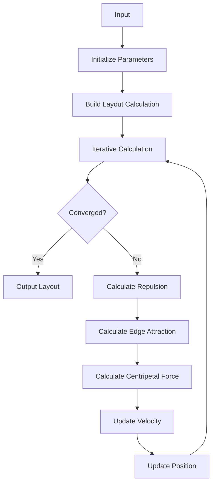

## Overview

Force-directed layout is a graph layout algorithm based on physical simulation that determines node positions by simulating attraction and repulsion forces between nodes. This layout is particularly suitable for displaying complex relationship networks, such as social networks and knowledge graphs.

The force-directed layout automatically calculates and adjusts node positions to maintain appropriate distances between connected nodes while minimizing edge crossings. During the layout process, it simulates a physical system where nodes repel each other like charged particles, and edges connect nodes like springs.

Key features of force-directed layout include:

1. **Automatic Arrangement**: No need to manually set node positions, the system automatically finds suitable positions
2. **Real-time Adjustment**: When you drag a node, other nodes will adjust their positions in real-time
3. **Flexible Configuration**:
   - Can adjust attraction and repulsion forces between nodes
   - Can set edge lengths
   - Can prevent node overlap
4. **Animation Effects**: Smooth animations during node movement make changes more natural


## Core Concepts

### Basic Principles of Force-directed Layout

Force-directed layout is a graph layout algorithm based on physical simulation that models nodes and edges as a physical system:

- Nodes are treated as physical particles
- Edges are treated as springs
- The entire system reaches its lowest energy state through physical simulation

### Detailed Core Forces

#### Node Repulsion

- **Physical Model**: Coulomb's Law
- **Function**: Prevents node overlap and ensures more uniform node distribution, where `factor` and `coulombDisScale` control the overall strength and range of repulsion.
- **Formula**:
  

  - k: Repulsion coefficient (`factor` / `coulombDisScale²`)
  - q1,q2: Node strength (`nodeStrength`)
  - r: Distance between nodes

#### Edge Attraction

- **Physical Model**: Hooke's Law
- **Function**: Simulates edge tension, moving nodes along edge directions, where `edgeStrength` and `linkDistance` control edge "stiffness" and length.
- **Formula**:
  

  - ka: Edge attraction strength (`edgeStrength`)
  - L: Edge length (`linkDistance`)
  - r: Actual edge length

#### Centripetal Force

- **Physical Model**: Newton's Universal Law of Gravitation
- **Function**: Attracts nodes toward the canvas center or cluster centers, where `gravity` and `center` control gravity strength and center point position
- **Formula**:
  

  - G: Gravitational constant (`gravity`)
  - xc: Center point coordinates (`center`)
  - mass: Node mass (`nodeSize`)

#### Interaction of Three Forces

- **Physical Model**: Force interactions, generating acceleration
- **Function**: Repulsion, edge attraction, and centripetal force work together, affecting node movement through acceleration superposition, ultimately reaching the lowest energy state.
- **Formula**:
  

### Physical System

#### Node Velocity Formula

- **Formula**:
  

  - v: Velocity
  - a: Acceleration
  - dt: Time step (`interval`)
  - damping: Damping coefficient (`damping`)

- **Function**:
  1. Controls node movement stability
  2. Damping coefficient prevents system oscillation
  3. Time step affects displacement per iteration

#### Node Position Formula

- **Formula**:
  

  - x: Node position
  - v: Node velocity
  - dt: Time step (`interval`)

- **Function**:
  1. Updates node position based on velocity
  2. Ensures motion continuity
  3. Prevents node overlap through `preventOverlap`

#### Cluster Center Calculation

- **Formula**:
  

  - n: Number of nodes in cluster
  - (xi​,yi​): Position of each node

- **Function**:
  1. Calculates cluster center
  2. Centripetal force pulls nodes toward their cluster center
  3. Cluster center can change dynamically

#### Cluster Strength Calculation

- **Formula**:
  

  - s: Cluster strength (`clusterNodeStrength`)
  - xc​: Cluster center

- **Function**:
  1. Controls cluster compactness
  2. Higher cluster strength means tighter clusters
  3. Can be dynamically adjusted based on node properties

#### Mass Effect on Forces

- **Formula**:
  

  - a: Acceleration
  - F: Force (repulsion, edge attraction, centripetal force)
  - mass: Node mass

- **Function**:
  1. Nodes with larger mass move less
  2. Nodes with smaller mass move more
  3. Mass calculation can be customized through `getMass`

#### Energy Calculation

- **Formula**:
  

  - m: Node mass
  - v: Node velocity

- **Function**:
  1. Monitors layout convergence
  2. System stabilizes when energy approaches zero

#### System Convergence Condition

- **Formula**:
  

- **Function**:
  1. Controls iteration count
  2. Stops when movement is below threshold
  3. Can choose between mean, maximum, or minimum through `distanceThresholdMode`

### Force Interaction Diagram




## Configuration Options

Based on the physical characteristics of force-directed layout, the following configuration options are available:

### Basic Configuration

| Property              | Description                                                                                                                                                                                                                                        | Default Value | Required |
| --------------------- | -------------------------------------------------------------------------------------------------------------------------------------------------------------------------------------------------------------------------------------------------- | ------------- | -------- |
| type                  | Layout type                                                                                                                                                                                                                                        | `force`       | ✓        |
| dimensions            | Layout dimensions, 2 for 2D layout, 3 for 3D layout                                                                                                                                                                                                | 2             |          |
| width                 | Layout width                                                                                                                                                                                                                                       | Canvas width  |          |
| height                | Layout height                                                                                                                                                                                                                                      | Canvas height |          |
| center                | Layout center point                                                                                                                                                                                                                                | Graph center  |          |
| maxIteration          | Maximum iteration count, if 0 will auto-adjust                                                                                                                                                                                                     | 0             |          |
| minMovement           | Stop iteration when average movement distance is less than 0.4                                                                                                                                                                                     | 0.4           |          |
| distanceThresholdMode | Movement distance calculation mode: mean: stop when average movement distance is less than `minMovement`; max: stop when maximum movement distance is less than `minMovement`; min: stop when minimum movement distance is less than `minMovement` | `mean`        |          |
| maxDistance           | Maximum distance                                                                                                                                                                                                                                   |               |          |

### Force-related Configuration

#### Repulsion Configuration

| Property        | Description                                                                                         | Default Value | Required |
| --------------- | --------------------------------------------------------------------------------------------------- | ------------- | -------- |
| nodeStrength    | Node force, positive values represent attraction between nodes, negative values represent repulsion | 1000          |          |
| factor          | Repulsion coefficient, larger values mean stronger repulsion                                        | 1             |          |
| coulombDisScale | Coulomb coefficient, a factor for repulsion, larger values mean stronger repulsion between nodes    | 0.005         |          |

#### Edge Attraction Configuration

| Property     | Description                                                                                                    | Default Value | Required |
| ------------ | -------------------------------------------------------------------------------------------------------------- | ------------- | -------- |
| edgeStrength | Edge force (attraction) strength, fixed force or callback function to dynamically return different edge forces | 500           |          |
| linkDistance | Edge length, fixed length or callback function to dynamically return different edge lengths                    | 200           |          |

#### Centripetal Force Configuration

| Property           | Description                                                                                                                                                                                                                                                          | Default Value | Required |
| ------------------ | -------------------------------------------------------------------------------------------------------------------------------------------------------------------------------------------------------------------------------------------------------------------- | ------------- | -------- |
| gravity            | Center force strength, the force attracting all nodes to the center. Larger values mean more compact layout                                                                                                                                                          | 10            |          |
| centripetalOptions | Centripetal force configuration, including center and strength for leaf nodes, isolated nodes, and other nodes. leaf: leaf node centripetal force; single: single node centripetal force; others: other node centripetal force; center: custom center point function | [0, 0]        |          |

#### Clustering Configuration

| Property            | Description                                                                                                                                                                                                                                                                                                                                                   | Default Value | Required |
| ------------------- | ------------------------------------------------------------------------------------------------------------------------------------------------------------------------------------------------------------------------------------------------------------------------------------------------------------------------------------------------------------- | ------------- | -------- |
| clustering          | Whether to cluster all nodes. If true, will use the field specified by nodeClusterBy in node data for clustering. centripetalOptions.single, centripetalOptions.leaf, and centripetalOptions.others will use the value returned by getClusterNodeStrength; leaf and centripetalOptions.center will use the average center of all nodes in the current cluster | `false`       |          |
| nodeClusterBy       | Specifies the field name in node data for clustering. Takes effect when clustering is true. Automatically generates centripetalOptions, can be used with clusterNodeStrength                                                                                                                                                                                  |               |          |
| clusterNodeStrength | Used with clustering and nodeClusterBy to specify the strength of the cluster centripetal force                                                                                                                                                                                                                                                               |               |          |
| leafCluster         | Whether to cluster leaf nodes. If true, centripetalOptions.single will be 100; centripetalOptions.leaf will use the value returned by getClusterNodeStrength; getClusterNodeStrength.center will return the average center of all leaf nodes                                                                                                                  | false         |          |

#### Performance and Optimization Configuration

| Property        | Description                                                                                                                                                                                                                                                               | Default Value | Required |
| --------------- | ------------------------------------------------------------------------------------------------------------------------------------------------------------------------------------------------------------------------------------------------------------------------- | ------------- | -------- |
| damping         | Damping coefficient, range [0, 1]. Larger values mean slower speed decrease                                                                                                                                                                                               | 0.9           |          |
| maxSpeed        | Maximum movement length per iteration                                                                                                                                                                                                                                     | 200           |          |
| interval        | Controls the movement speed of each node per iteration                                                                                                                                                                                                                    | 0.02          |          |
| preventOverlap  | Whether to prevent overlap. Must be used with nodeSize or data.size in node data. Only when data.size is set in the data or nodeSize is configured in the layout with the same value as the node size in the graph, collision detection for node overlap can be performed | true          |          |
| nodeSize        | Node size (diameter). Used for collision detection to prevent node overlap. Fixed size or callback function to dynamically return node size                                                                                                                               |               |          |
| nodeSpacing     | Takes effect when preventOverlap is true. Minimum spacing between node edges to prevent overlap. Can be a callback to set different spacing for different nodes                                                                                                           |               |          |
| collideStrength | Strength of anti-overlap force, range [0, 1]                                                                                                                                                                                                                              | 1             |          |

#### Other Configuration

| Property  | Description                                                                                                                                                                              | Default Value | Required |
| --------- | ---------------------------------------------------------------------------------------------------------------------------------------------------------------------------------------- | ------------- | -------- |
| getMass   | Callback for the mass of each node. The parameter is the node's internal data, and the return value is the mass                                                                          |               |          |
| getCenter | Callback for the x, y, and strength of the centripetal force for each node. If not specified, no extra centripetal force is applied                                                      |               |          |
| onTick    | Callback for each iteration                                                                                                                                                              |               |          |
| monitor   | Callback for monitoring each iteration. energy indicates the convergence energy of the layout. May incur extra computation if configured; if not configured, no computation is performed |               |          |

## Code Examples

### Basic Usage

```js
const graph = new Graph({
  container: 'container',
  layout: {
    type: 'force',
    // Prevent node overlap
    preventOverlap: true,
    // Node size
    nodeSize: 20,
    // Layout width
    width: 800,
    // Layout height
    height: 600,
  },
});
```

### Preventing Node Overlap

```js
const graph = new Graph({
  layout: {
    type: 'force',
    // Prevent node overlap
    preventOverlap: true,
    // Node size
    nodeSize: 20,
  },
});
```

### Force-directed Layout

This example demonstrates how to create a basic force-directed graph using force-directed layout.

```js
import { Graph, NodeEvent } from '@antv/g6';

const data = {
  nodes: [
    { id: 'node1', label: 'Node 1', size: 30 },
    { id: 'node2', label: 'Node 2', size: 20 },
    { id: 'node3', label: 'Node 3', size: 20 },
    { id: 'node4', label: 'Node 4', size: 20 },
    { id: 'node5', label: 'Node 5', size: 30 },
    { id: 'node6', label: 'Node 6', size: 20 },
  ],
  edges: [
    { source: 'node1', target: 'node2' },
    { source: 'node1', target: 'node3' },
    { source: 'node2', target: 'node4' },
    { source: 'node3', target: 'node4' },
    { source: 'node4', target: 'node5' },
    { source: 'node5', target: 'node6' },
  ],
};

const graph = new Graph({
  container: 'container',
  data,
  autoFit: 'view',
  modes: {
    default: ['drag-canvas', 'zoom-canvas'],
  },
  layout: {
    type: 'force',
    // Prevent node overlap
    preventOverlap: true,
    // Node size
    nodeSize: 20,
    // Centripetal force
    gravity: 0.9,
    // Iteration count
    iterations: 100,
  },
  node: {
    style: {
      size: (d) => d.size,
      fill: '#9EC9FF',
      stroke: '#69C8FF',
      label: (d) => d.label,
      labelPlacement: 'center',
      labelFill: '#333',
    },
  },
  edge: {
    style: {
      stroke: '#e2e2e2',
    },
  },
});

graph.on(NodeEvent.CLICK, async (e) => {
  const nodeId = e.target.id;
  graph.updateNodeData([{ id: nodeId, size: 200 }]);
  await graph.render();
});

graph.render();
```

Key configuration explanations:

- `preventOverlap`: Enable node overlap detection
- `nodeSize`: Set node size
- `gravity`: Set node centripetal force
- `iterations`: Set layout calculation precision

You can also refer to [View Examples](https://g6.antv.antgroup.com/examples/layout/force-directed/#force) for more usage examples.
